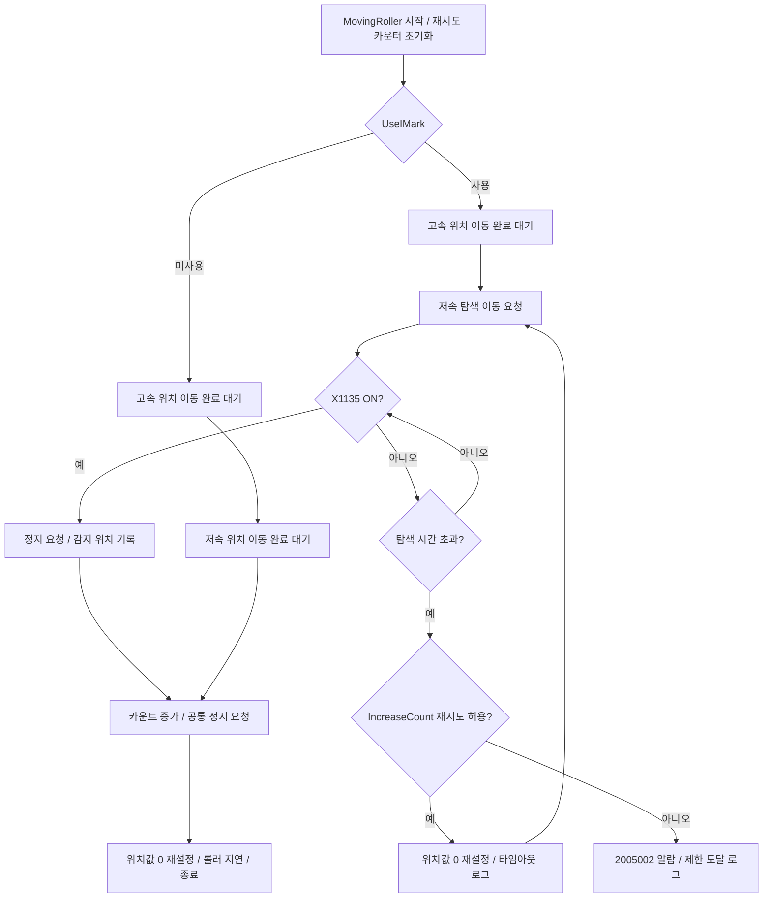

# I-Mark 시퀀스 및 상세 로그 점검 보고서

- 작업일: 2026-09-08, 한국시간
- 작업 식별시각: 20260908_143852
- 대상 소스: `D:\Works_Updates\대주이엔지\Git_IONE_5AXIS`
- 대상 입력: X1135, RearLoadingUnit / RearModule / BandRollerServo
- 요청: 현재 I-Mark 시퀀스 설명, 분석에 필요한 로그의 충분성 점검 및 보강
- 검증 완료: 2026-09-08 14:50 이후, Debug / x86 빌드 성공 및 모의 검증 38개 통과

## 1. 점검 결론

기존 IMarkLog 기록 함수와 일부 기록 지점은 있었지만, 시작 조건, 시퀀스 구분, 타임아웃 횟수, 최종 알람, 초기화/수동 탐색, 중단/재개 이력이 충분하지 않았다. 이번에 5개 시퀀스에 공통 진단 기록을 연결하고, 판단 결과를 기록하는 지점을 추가했다.

입력/모터 명령/분기/재시도 제한 등 기존 설비 제어 조건은 유지했다. 로그만으로 확인할 수 있는 범위와 기존 제어상 주의점은 아래에 별도로 설명한다. 실제 설비를 기동하거나 물리 IO를 조작하지 않았다.

점검 시작 시 이 작업 폴더의 `FAFramework\bin\Debug\Log\VT3500`에는 IMarkLog 파일이 없었다. 따라서 과거 실물 설비 로그에 대한 분석 완료를 의미하지 않는다. 검증 로그는 별도 임시 폴더에서 모의 입력으로 생성했다.

## 2. 입력 및 사용 설정

| 항목 | 확인 내용 |
|---|---|
| 센서 파트 | `RearLoadingUnit.IMarkCheckSensor` |
| 시퀀스 참조 | `RearModule.IMarkCheckSensor` |
| IO | `DeviceNet`, `X1135` |
| 센서 반전 설정 | 현재 PartList.xml의 `InputInverse=false` |
| JOB 설정 | `설정 > JOB 설정 > 아래쪽 옵션 > I-Mark X1135 > 사용` |
| JOB 전달 | `FAMainLoopModule`에서 `MoveJobInfo.UseIMark`를 `RearModule.UseIMark`에 전달 |
| 시작 판단 | 로그의 `START`/`MODE_SELECTED`/`BYPASS`에 실제 메모리 설정을 기록 |

참조 파일:

- `FAFramework\bin\Debug\config\VT3500\RearLoadingUnit\PartList.xml`
- `FAFramework\bin\Debug\config\DeviceList.xml`
- `FAFramework\VT3500\Modules\FAMainLoopModule.cs`
- `FAFramework\VT3500\GUI\PositionControl.xaml`

`ModuleParameters.xml`의 저장된 `UseIMark`는 점검 시 false였지만, JOB을 로드하면 변경될 수 있다. 실제 운전 중인 메모리 값은 이 파일만으로 확정할 수 없다.

## 3. 자동 운전 / 일부 1사이클: MovingRoller

주요 코드: `FAFramework\VT3500\Modules\FARearLoadingModule.cs`의 `MakeMovingRoller()`.

1. 시작 시 `RetryInfoBlackMarkRetry.ClearCount()`로 재시도 카운터를 초기화한다.
2. `UseIMark=true`이면 `MoveTapeLoadingPos.Sequence`로 고속 위치 이동을 실행하고 완료를 기다린다.
3. `MoveTapeLoadingSlowPos.Execute`로 저속 탐색 이동을 요청한다.
4. 다음 감지 단계에서 X1135가 ON이면 `Stop.Execute`를 요청하고 공통 완료 처리로 이동한다.
5. 정해진 시간까지 ON이 아니면 `IncreaseCount()`를 호출한다.
6. 재시도가 허용되면 `RModuleServoOff=true`로 설정하고, `SettingHomeMarking`으로 실제/명령 위치값을 0으로 재설정한 뒤 저속 탐색으로 돌아간다.
7. 제한에 도달하면 `AlarmBlackMarkCheckTimeOut` 알람을 발생시킨다. 현재 번호는 `2005002`이다.
8. 감지 성공 시 `RModuleServoOff=false`, `CurrentCount++`, `UICuttingCount += 2` 후 정지를 다시 요청한다.
9. `SetHomeMarking`으로 위치값을 0으로 재설정하고 `TimeRollerDelay` 후 종료한다.

`RModuleServoOff`는 이 코드에서 상태값으로 설정하는 변수다. 이름만 보고 실제 Servo OFF 명령이 실행되었다고 해석하면 안 된다.

`UseIMark=false`이면 센서 정지 판단을 건너뛰고 고속 위치 이동과 저속 위치 이동을 각각 완료한 후 같은 카운트/위치 초기화 처리를 수행한다. 이 경로는 로그에서 `BYPASS`로 구분한다.



### 현재 파일 설정

설정 파일: `FAFramework\bin\Debug\config\VT3500\ModuleParameters.xml`의 `RearModule`.

| 항목 | 저장값 | 의미 |
|---|---:|---|
| TimeLoadingTimeout | 1초 | 자동 저속 탐색 단계의 타임아웃 |
| TimeLoadingInitialTimeout | 1초 | 초기화 탐색의 반복 판단 시간 |
| RetryInfoBlackMarkRetry.RetryLimit | 3 | 세 번째 타임아웃에 제한 도달 |
| TimeRollerDelay | 100ms | 위치 초기화 후 지연 |

`FARetryInfo.IncreaseCount()`는 `RetryCount + 1 >= RetryLimit`이면 false를 반환하면서 카운터를 0으로 되돌린다. 따라서 제한값 3은 **처음 탐색 + 재시도 2회, 세 번째 타임아웃에 알람**이다. 새 로그는 초기화 전의 차수를 `TimeoutNumber=3`으로 보존한다.

총 동작 시간이 정확히 3초라는 뜻은 아니다. 고속 이동, 명령 실행, 스케줄러 주기, 일시정지 시간 등은 별도다. 각 탐색 단계에서 사용한 경과시간은 `WaitMs`로 기록한다.

## 4. 초기화 및 수동 경로의 차이

| 시퀀스 | 사용 설정 | 감지/이동 방식 | I-Mark 탐색 제한 |
|---|---|---|---|
| Initialize | UseIMark 적용 | 컷터 상승/프레스 원점 이동, 롤러 하강 확인, 위치 0 설정 후 저속 탐색. ON이면 정지 후 공통 초기화 | 1초마다 다시 탐색. 전체 반복 횟수 제한 없음 |
| MovingRoller | UseIMark 적용 | 고속 완료 후 저속 탐색, ON이면 정지 | 현재 1초, 세 번째 타임아웃에 알람 |
| ManualWorkLoading | UseIMark 적용 | 고속 완료 후 저속 탐색. 미감지 시 위치 0 설정과 저속 이동 재요청 | 타임아웃/횟수 제한 없음 |
| WorkManualLoading: 연속 | UseIMark 조건 분기 없음 | 속도 이동 요청 후 ON이면 정지/위치 초기화/컷팅. OFF이면 정지/위치 초기화 후 반복 | 타임아웃/횟수 제한 없음. NULL/Unknown이면 해당 판단 단계에 머물 수 있음 |
| WorkManualLoading: 단계 | I-Mark 판단 없음 | 위치 이동 후 단계 진행 및 컷팅 | I-Mark 탐색을 하지 않음 |
| SearchingImark | UseIMark 조건 분기 없음 | 사용자 동작 확인 후 저속 탐색 반복, ON이면 정지 후 종료 시 위치 초기화 | 타임아웃/횟수 제한 없음 |

`ManualWorkLoading`과 `WorkManualLoading`은 이름이 비슷하지만 다른 시퀀스다. 전체/포장 1사이클의 상위 시퀀스에 따라 `MovingRoller` 또는 `ManualWorkLoading`을 호출할 수 있으므로, 로그의 `Seq`와 `Caller`를 확인해야 한다.

위 무제한 탐색, UseIMark 미적용 수동 경로 등은 기존 제어 동작이다. 이번 변경은 로그 보강 요청에 맞추어 해당 차이를 명시적으로 기록하며 제어 제한을 새로 추가하지 않았다.

## 5. 기존 제어를 해석할 때 주의할 점

- 자동 감지 판단은 고속 이동 완료 후의 저속 감지 단계에서 한다. 고속 이동 중 들어왔다가 사라진 짧은 ON을 저장해 사용하는 래치 로직은 없다.
- OFF에서 ON으로 바뀌는 엣지 검출이 아니라 현재 ON 상태 검사다. 탐색 진입 전에 이미 ON이어도 감지 성공으로 처리할 수 있다.
- 별도의 I-Mark 디바운스 시간이나 신호 안정화 판정은 이 모듈에 없다.
- `Stop.Execute`는 정지 요청이다. 이 시퀀스에는 감지 후 별도의 정지 완료 대기 단계를 넣지 않고 위치 초기화로 진행하는 구간이 있다. 따라서 `DETECTED_STOP_REQUESTED`만으로 기계의 완전 정지를 확정할 수 없다.
- 위치값은 제어기에서 읽어 온 값이며, 홈마킹 이후 좌표 기준이 바뀐다. 서로 다른 홈마킹 구간의 ActualPos 차이를 그대로 실제 이송거리로 계산하면 안 된다.

## 6. 추가한 로그

| 항목 | 추가 내용 |
|---|---|
| 실행 구분 | 매 시작마다 RunId 생성, Seq/Caller/Job/ProductId 기록 |
| 시작 조건 | UseIMark, 실제/명령 위치, IO 이름/인덱스/값/반전, 시뮬레이션 여부 |
| 운전 조건 | 고속/저속 위치와 속도, 가감속 설정, 속도 배율, 타임아웃, 제한값, 카운트 |
| 단계 | Step/StepName/Action으로 이동·탐색·홈마킹 단계 진입 식별 |
| 입력 | 최초 입력과 관측된 변화, NULL/Unknown/읽기 오류 구분 |
| 모터 | ServoOn/RunFlag/MotionDone/ServoAlarm 변화 및 위치 스냅샷 |
| 감지 | ON 판단, 정지 요청, 정지 요청 전 읽은 감지 위치, 자동 탐색 경과시간 |
| 재시도 | 타임아웃 차수, 제한값, 다음 이동 경로, 홈마킹 전후 구분 |
| 실패 | 최종 알람 번호, 입력 상태, 시퀀스 오류/상태 |
| 작업 중단 | 일시정지 요청/진행/완료, 재개, 외부 중단, 종료, 상태 초기화 |
| 장시간 대기 | 실행 중 스케줄러가 돌면 5초마다 HEARTBEAT |
| 반복량 관리 | 동일 반복 이벤트는 첫 회와 5초 간격 누계, 종료 시 REPEAT_TOTAL |
| 설정 변경 | UseIMark가 메모리에서 변경되면 이전/이후 값 기록 |

반복 요약 대상은 동일 단계 재진입과 빠른 수동 탐색 반복이다. 감지·알람·중단 등의 판단 결과는 발생 시 기록한다.

## 7. 저장 신뢰성 보강

`LogManager.cs`에서 다음을 보강했다.

1. 기존에는 매 로그 처리마다 10ms를 대기했다. 이제 기록 대기열이 비었을 때만 대기하므로 새 상세 로그 때문에 불필요하게 저장이 밀리는 것을 줄인다.
2. CSV 로그의 폴더 생성도 예외 처리 안으로 포함했다. 폴더 생성 실패로 로그 작업 스레드가 종료되는 것을 방지한다.
3. 파일 공유/잠금 오류는 25ms 간격, 최대 5회 추가 재시도한다. 최대 대기는 125ms이다. 다른 IO 오류는 그대로 실패 처리한다.
4. 최종 IMarkLog 저장 실패는 파일 경로와 예외를 SystemLog 및 디버그 출력에 보고한다.
5. 진단 스냅샷/출력 예외가 설비 시퀀스를 중단시키지 않도록 방어하고, 외부 정지 이벤트와 감시 콜백이 겹치는 경우를 위한 동기화를 추가했다.

이는 비동기 메모리 큐 기반 기록이다. 강제 종료/전원 차단 직전 미기록분, 저장 매체 고장, 장시간 파일 잠금까지 무손실 저장을 보장하지는 않는다. SystemLog도 저장 불가능한 경우 디버그 출력만 남을 수 있다.

## 8. 파일과 보관 기간

실제 실행 파일이 `FAFramework\bin\Debug\FAFramework.exe`인 경우:

```text
D:\Works_Updates\대주이엔지\Git_IONE_5AXIS\FAFramework\bin\Debug\Log\VT3500\IMarkLog\YYYY\MM\YYYY-MM-DD.log
```

예상 일자별 파일 예시(실물 설비 로그가 생성되었다는 뜻은 아님):

```text
D:\Works_Updates\대주이엔지\Git_IONE_5AXIS\FAFramework\bin\Debug\Log\VT3500\IMarkLog\2026\09\2026-09-08.log
```

- 같은 메시지는 TraceLog가 활성화되어 있으면 TraceLog에도 기록된다. IMarkLog는 TraceLog 비활성화와 무관하게 기록한다.
- 설정 파일: `FAFramework\bin\Debug\config\log_setting.cfg`
- 현재 값: `IMarkLog=7`
- 삭제 기준: 파일의 마지막 쓰기 시각에서 7일 초과. 로그 기록 작업 중 약 10분 간격으로 삭제 대상 점검.
- UI: `설정 > 시스템 > LOG 파일 자동삭제 기간 설정 > IMarkLog > LOG 기간 저장`.
- 다른 경로의 실행 파일을 실행하면 해당 실행 경로에 로그가 생성될 수 있다.

## 9. 수정 파일 및 검증

| 파일 | 변경 |
|---|---|
| FAFramework/VT3500/Modules/FARearLoadingModule.cs | 5개 시퀀스에 진단 연결, 판단 결과 및 설정/IO/모터 스냅샷 추가 |
| FAFramework/VT3500/Modules/IMarkSequenceDiagnostics.cs | 실행 ID, 생명주기/상태/입력 감시, 반복 로그 요약 |
| FAFramework/Manager/LogManager.cs | 대기열 처리, 파일 잠금 재시도, 폴더/쓰기 실패 기록 |
| FAFramework/FAFramework.csproj | 신규 진단 소스 컴파일 등록 |
| Tests/IMarkDiagnosticsTests.cs | 실제 시퀀스 엔진/자동 시퀀스와 파일 기록 검증 |
| Tests/Run-IMarkDiagnosticsTests.ps1 | 별도 임시 폴더에 테스트 실행 파일/로그 생성 |

검증 결과:

- 최종 빌드: Debug / x86, 오류 0개, 기존 숨김/미사용 변수 등 경고 16개(임시 WPF 프로젝트와 본 프로젝트 중복 포함).
- Fody 처리 및 최종 실행 파일 복사 완료.
- 검증 38개 통과. 실제 MovingRoller의 정상 감지/미사용/타임아웃/센서 누락 경로를 모의 IO 및 명령 카운터로 검증.
- 1만 회 빠른 재시도 요약, 정확한 누계, 중단/재개, 예외 격리, TraceLog 비활성 상태의 파일 생성, 순서 보존, 일시 파일 잠금 복구, 저장 실패 후 기록 지속을 검증.
- 시험용 타임아웃은 빠른 검증을 위해 1ms로 설정했다. 운영 XML의 1초 값을 변경하지 않았다.
- 실물의 센서 응답속도, 신호 폭, 감속거리, 정확한 정지 위치 및 UI 조작은 시험하지 않았다.
- 빌드 중 WPF/Fody 중간 파일의 일시적 파일 잠금 오류가 있었으며 재실행 후 정상 빌드 및 테스트를 완료했다.
- 테스트에서 발견한 파일 읽기/쓰기 잠금으로 인한 누락 문제를 추가 보완한 후 최종 38개 검증을 다시 통과했다.
- 빌드로 기존 Git 관리 대상인 bin/obj 산출물도 갱신되었다. 운영 config 값과 UI 소스는 이번 작업에서 변경하지 않았다.

## 10. 이번 산출물

- `20260908_143852_IMark_시퀀스_로그점검_보고서.md` (이 파일)
- `20260908_143852_IMark_로그분석_안내.md`
- `20260908_143852_IMark_build.log`
- `20260908_143852_IMark_test.log`
- `20260908_143852_IMark_모의실행_원본로그.log`

모두 저장 폴더: `D:\Works_Updates\대주이엔지\Git_IONE_5AXIS\Doc`.

최종 시험 실행 폴더: `C:\Users\Administrator\AppData\Local\Temp\IMarkDiagnostics-3805ca3281db4823b4ed9f8c5888b109`.
